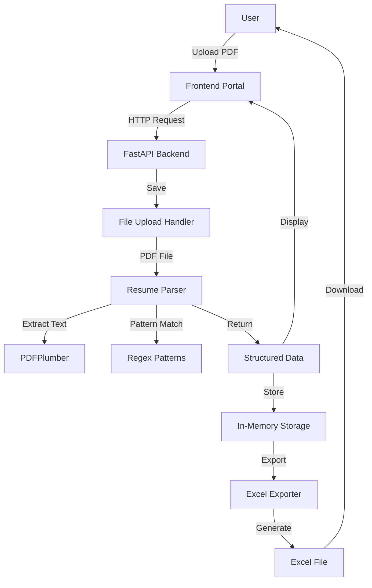
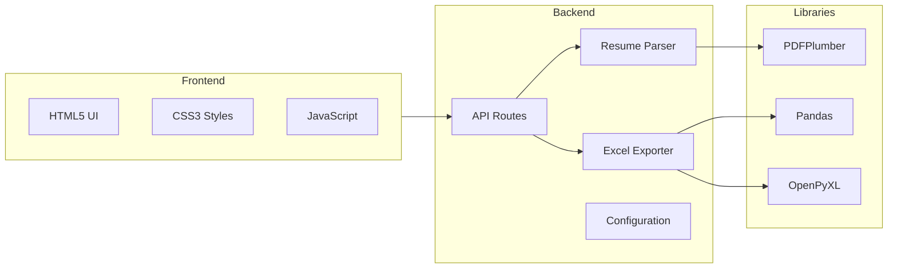
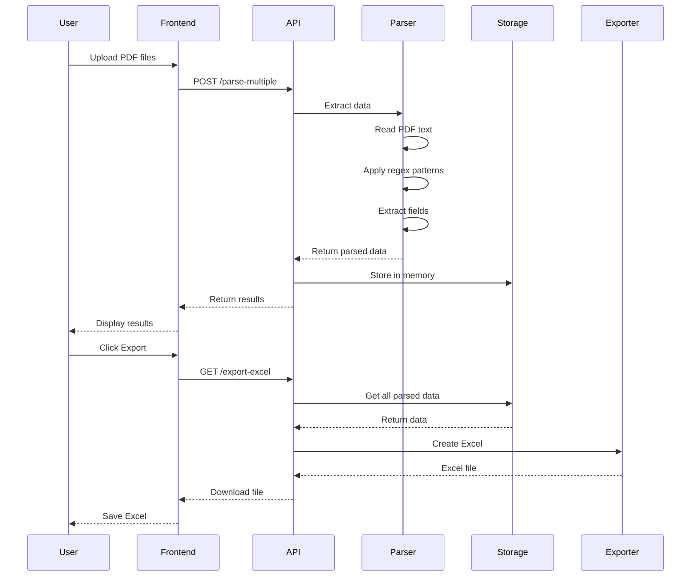
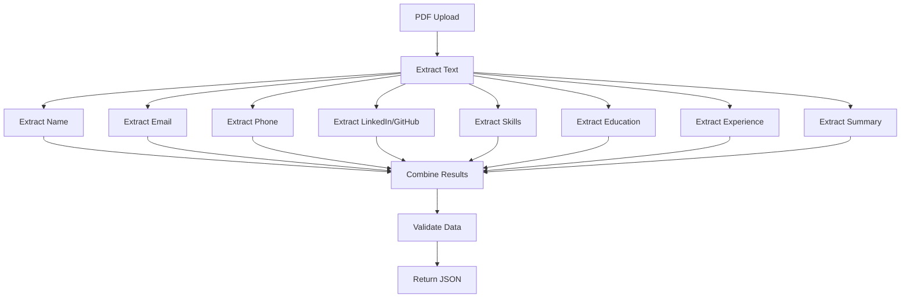

# Resume Parser Architecture

## System Overview



## Component Architecture



## Data Flow



## Parser Workflow



## Technology Stack

### Backend

| Component | Technology | Purpose |
|-----------|------------|----------|
| Framework | FastAPI | RESTful API server |
| PDF Parser | PDFPlumber | Extract text from PDFs |
| Data Processing | Pandas | Structure and manipulate data |
| Excel Export | OpenPyXL | Generate Excel files |
| Validation | Pydantic | Data validation |
| CORS | FastAPI Middleware | Cross-origin requests |

### Frontend

| Component | Technology | Purpose |
|-----------|------------|----------|
| Structure | HTML5 | Page layout |
| Styling | CSS3 | Modern UI with gradients |
| Logic | Vanilla JavaScript | API calls, DOM manipulation |
| Fetch API | Native | HTTP requests |

## API Endpoints

### Resume Parser Routes

```
PREFIX: /api/resume-parser

POST   /parse            - Parse single PDF resume
POST   /parse-multiple   - Parse multiple PDF resumes
GET    /export-excel     - Export all parsed resumes to Excel
GET    /parsed-resumes   - Get all parsed resumes (JSON)
DELETE /clear            - Clear all parsed resumes
GET    /health           - Health check
```

## Data Model

### Parsed Resume Structure

```json
{
  "name": "John Doe",
  "email": "john.doe@example.com",
  "phone": "+1-555-123-4567",
  "linkedin": "https://linkedin.com/in/johndoe",
  "github": "https://github.com/johndoe",
  "skills": ["Python", "JavaScript", "React", "AWS"],
  "education": "Bachelor of Science in Computer Science",
  "experience_years": "5 years",
  "summary": "Experienced software engineer...",
  "filename": "john_doe_resume.pdf",
  "parsed_date": "2026-08-19T10:30:00"
}
```

## Pattern Matching Strategy

### Email Detection
- **Pattern**: `[a-zA-Z0-9._%+-]+@[a-zA-Z0-9.-]+\.[a-zA-Z]{2,}`
- **Method**: Regex search
- **Validation**: First match only

### Phone Detection
- **Pattern**: International format with optional country code
- **Method**: Regex search with length validation
- **Validation**: Minimum 10 digits

### Skills Detection
- **Method**: Dictionary-based keyword matching
- **Dictionary**: 200+ technical keywords
- **Matching**: Case-insensitive word boundary search

### Education Detection
- **Keywords**: bachelor, master, phd, degree, diploma
- **Method**: Context-aware line extraction
- **Enhancement**: Include surrounding lines for full context

### Experience Detection
- **Primary**: Explicit "X years experience" patterns
- **Secondary**: Date range calculation from years found
- **Validation**: Reasonable range (0-50 years)

## Storage Strategy

### In-Memory Storage
- **Type**: Python list
- **Scope**: Session-based
- **Lifecycle**: Cleared on server restart
- **Advantages**: Fast, simple, no database needed
- **Limitations**: Data lost on restart

### Future Enhancements
- Add PostgreSQL for persistence
- Add Redis for caching
- Add user sessions
- Add authentication

## Security Considerations

### Current Implementation
- ✅ File type validation (PDF only)
- ✅ CORS configuration
- ✅ Input sanitization
- ✅ No LLM API keys to protect

### Recommended Enhancements
- ⚠️ Add file size limits
- ⚠️ Add rate limiting
- ⚠️ Add virus scanning
- ⚠️ Add user authentication
- ⚠️ Add HTTPS in production

## Performance

### Benchmarks (Estimated)
- PDF text extraction: ~1-2 seconds per file
- Pattern matching: <100ms per resume
- Excel generation: ~500ms for 100 resumes
- Total processing: ~2 seconds per resume

### Optimization Opportunities
- Parallel processing for multiple files
- Caching for repeated patterns
- Streaming for large files
- Background tasks for heavy processing

## Deployment

### Development
```bash
# Backend
cd backend
uvicorn app.main:app --reload --host 0.0.0.0 --port 8000

# Frontend
cd frontend
python -m http.server 3000
```

### Production (Recommended)
```bash
# Backend with Gunicorn
cd backend
gunicorn app.main:app -w 4 -k uvicorn.workers.UvicornWorker --bind 0.0.0.0:8000

# Frontend with Nginx
# Configure nginx to serve static files from frontend/
```

## Error Handling

### Frontend
- Network errors: Toast notification
- Invalid files: Filter and warn user
- Server errors: Display error message

### Backend
- Invalid PDFs: Return 400 with error details
- Server errors: Return 500 with sanitized message
- Validation errors: Return 422 with field details

## Monitoring

### Metrics to Track
- Resumes parsed per hour
- Average parsing time
- Error rate
- Most common skills detected
- File upload sizes

### Logging
```python
# FastAPI automatic logging
INFO:     127.0.0.1:54321 - "POST /api/resume-parser/parse-multiple HTTP/1.1" 200 OK
```

## Future Roadmap

1. **Phase 1** (Current) ✅
   - Basic PDF parsing
   - Pattern matching extraction
   - Excel export
   - Web interface

2. **Phase 2** (Planned)
   - Database integration
   - User authentication
   - Advanced search
   - Resume comparison

3. **Phase 3** (Future)
   - OCR for scanned PDFs
   - Word document support
   - AI-enhanced matching
   - Candidate ranking

---

**Architecture designed for simplicity, scalability, and no external API dependencies.**
