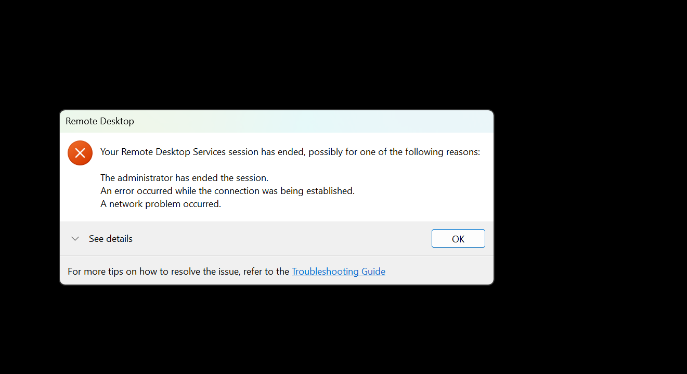

# TalentFox Resume Parser

<div align="center">
  
  <h3>AI-Powered Resume Parser for HR Teams</h3>
  <p>Parse PDF resumes and export to Excel - No LLM API Required</p>
</div>

---

## ✨ Features

- 📄 **PDF Resume Parsing** - Extract name, email, phone, skills, education, experience
- 📊 **Excel Export** - Download all parsed data in Excel format
- 🔍 **Smart Search** - Search candidates by name, email, skills
- 🎯 **Advanced Filtering** - Filter by experience level and skills
- 📊 **Analytics Dashboard** - View statistics and insights
- 🎨 **Modern UI** - Beautiful olive green & white theme with TalentFox branding

---

## 🛠️ Tech Stack

**Backend:**
- Java 21 + Spring Boot 3.2.1
- Apache PDFBox (PDF parsing)
- Apache POI (Excel export)
- Pattern matching (No LLM API needed!)

**Frontend:**
- HTML5 + CSS3 + Vanilla JavaScript
- Responsive design
- Font Awesome icons

---

## 🚀 Quick Start

### Prerequisites
- Java 21 or higher
- Maven (included via wrapper)
- Modern web browser

### Run Locally

1. **Start Backend:**
```bash
cd backend-java
mvnw.cmd spring-boot:run
```

2. **Start Frontend:**
```bash
cd frontend
python -m http.server 3000
```

3. **Access App:**
- Frontend: http://localhost:3000
- Backend: http://localhost:8080

---

## 🌐 Deployment

See [STEP_BY_STEP_DEPLOYMENT.md](STEP_BY_STEP_DEPLOYMENT.md) for detailed deployment guide.

**Free Hosting:**
- Backend: Railway.app (500 hrs/month FREE)
- Frontend: Vercel.com (Unlimited FREE)

---

## 📸 Screenshots

### Upload Interface
Drag & drop PDF resumes or click to browse

### Candidates Dashboard
View all parsed candidates with filters and search

### Analytics
Insights and statistics from parsed resumes

---

## 📝 How It Works

1. **Upload** PDF resumes (single or multiple)
2. **Parse** using pattern matching and keyword extraction
3. **View** candidates in beautiful card layout
4. **Filter** by experience, skills, or search
5. **Export** all data to Excel with one click

---

## 🎯 Features in Detail

### Extraction Capabilities
- ✅ Name
- ✅ Email
- ✅ Phone Number
- ✅ LinkedIn Profile
- ✅ GitHub Profile
- ✅ Skills (70+ technical skills)
- ✅ Education
- ✅ Years of Experience
- ✅ Professional Summary

### Supported Skills
Python, Java, JavaScript, React, Angular, Node.js, Spring Boot, Docker, AWS, Azure, Machine Learning, and 60+ more!

---

## 🔒 Privacy

- All processing happens on your server
- No data sent to third-party APIs
- No LLM API keys required
- Session-based storage (data cleared on restart)

---

## 💻 Development

### Project Structure
```
talentfor-hr/
├── backend-java/          # Spring Boot backend
│   ├── src/main/java/
│   │   └── com/talentfor/resumeparser/
│   │       ├── controller/
│   │       ├── service/
│   │       └── model/
│   └── pom.xml
│
├── frontend/             # HTML/CSS/JS frontend
│   ├── index.html
│   ├── styles.css
│   ├── app.js
│   └── logo.png
│
└── STEP_BY_STEP_DEPLOYMENT.md
```

---

## ⚙️ Configuration

### Backend Port
Default: 8080 (change in `application.properties`)

### Frontend API URL
Update in `app.js`:
```javascript
const API_BASE_URL = 'http://localhost:8080/api/resume-parser';
```

---

## 🔧 Troubleshooting

### Build Issues
- Ensure JDK 21 is installed
- Check JAVA_HOME environment variable

### CORS Errors
- Backend allows all origins by default
- Check browser console for details

### Upload Not Working
- Verify backend is running
- Check file is PDF format
- See browser console for errors

---

## 📝 License

MIT License - Feel free to use for your projects!

---

## 👥 Credits

Developed for TalentFox - Your Recruitment Partner

Website: [www.talentfox.com](https://www.talentfox.com)

---

## 🚀 Future Enhancements

- [ ] Support for DOCX resumes
- [ ] Batch processing improvements
- [ ] Advanced analytics
- [ ] Candidate ranking
- [ ] Email integration
- [ ] ATS integration

---

**Made with ❤️ for HR Teams**
